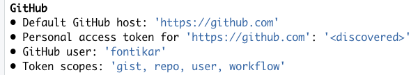
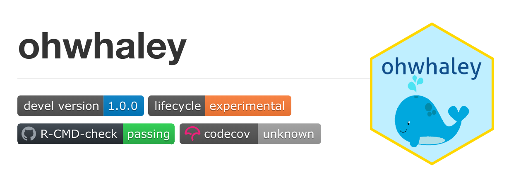

```{r BTS, include=FALSE}
knitr::opts_chunk$set(echo = TRUE,
                      warning = FALSE,
                      message = FALSE,
                      error = FALSE, 
                      eval = FALSE)

pacman::p_load(dplyr)
```


```{r klippy, eval=TRUE, echo=FALSE, include=TRUE}
klippy::klippy(position = c('top', 'right'))
```

In this part of the workshop, we will implement a few **GitHub Actions Continuous Integration workflows** for our R package we made in the previous session 📦! 

We will be using template workflows developed by the [amazing team of contributors](https://github.com/r-lib/actions/graphs/contributors) that run the [r-lib/actions](https://github.com/r-lib/actions) repo. Massive shout out to these folks for making our lives easier! 👏👏👏

### Helpful resources 🧑‍🏫
To get a general sense of what GitHub Actions Workflows are for R users, I recommend:

- Jim Hester's rstudio::conf 2020 [talk and slide deck](https://www.jimhester.com/talk/2020-rsc-github-actions/) 
- Bea Milz 's [how-to blog](https://beamilz.com/posts/series-gha/2022-series-gha-1-what-is/en/#how-to-use-gha-in-an-r-package) 

If you want to know all the nitty-gritty details and eventually write your own custom GHA workflows, I recommend 🔍: 

- The [GHA official documentation](https://docs.github.com/en/actions/learn-github-actions/understanding-github-actions).
- The [documentation](https://github.com/r-lib/actions/tree/v2-branch/examples) in r-lib/actions repo
- The [Workflow Syntax](https://docs.github.com/en/actions/using-workflows/workflow-syntax-for-github-actions) section of the GHA documentation. I've looked at this a few times to understand what exactly each step in r-lib/actions workflows were doing

### Let's get started! 🚀

If you haven't already, lets load `{devtools}`! We might need a few other packages below, but we will load/install these as we go! 

```{r Prep}
#install.packages("devtools")

library(devtools) #Will load usesthis and roxgen2 as well
```

### Git set go!!! 🏁

Before we jump in, we have to make sure:

1. [git] the version control software is installed
2. your [GitHub Personal Access Token (PAT)](https://docs.github.com/en/authentication/keeping-your-account-and-data-secure/creating-a-personal-access-token) are set up correctly! Your PAT is our key to GitHub's API 🔑

Want to learn more about PAT? Highly recommend [this section](https://happygitwithr.com/https-pat.html) of the Happy Git and GitHub for the useR!

First, we can check if we have git and PAT installed/set up correctly. You may have done so in previous projects! Your past self has your back! 🙏

```{r sanity check}
git_sitrep() # git situation report
```

If git and PAT has already been set up, we would see this under the bold heading **GitHub**:



If you don't see this ⚠️ Follow the next steps to git sorted 😉 

#### Install git 👾

git installation is  via the shell terminal and is OS dependent, so take a look at [this chapter](https://happygitwithr.com/install-git.html#install-git){target="_blank"} of Happy git with R to get started!

#### Create a PAT token! 🎟
I recommend having a good read of `?usethis::gh_token_help()` and follow the instructions there

If you want more details, try the [tl;dr section](https://happygitwithr.com/https-pat.html#tldr){target="_blank"} of the Happy Git and GitHub for the useR book and the subsequent chapters, these will get you on your feet in no time! 

```{r good help and create}
?usethis::gh_token_help()
```

This function will open up a browser for you to select the scopes you want to your PAT to do. The recommended scopes are already pre-selected for ya!

```{r token}
usethis::create_github_token() 
```

If `usethis::create_github_token()` fails, try this link to create a PAT manually on the [GitHub Website](https://github.com/settings/tokens/new?scopes=repo,user,gist,workflow&description=R:GITHUB_PAT){target="_blank"}

#### Saving PAT on your system 💾

Once you a PAT has been created for you, **copy and save this in your password manager!** For security reasons, you won't get to see the PAT again if you close the browser!  Now we will register your PAT using:

```{r gitset}
#install.packages("gitcreds")
gitcreds::gitcreds_set()
```

Once this is complete, just for peace of mind... check your git settings are OK!

```{r check twice}
git_sitrep() # git situation report
```

### Our first GitHub Action! 💥

**`{usethis}`** will be your portal to the most commonly use R GHA templates! You can access any of the templates from the `r-lib/actions` repository.

Remember `devtools::check()` from our previous sessions? Well, for our first workflow, we are going to set up a GHA to run `R-CMD-CHECK` on our R package in one operating system (by default its Ubuntu), on the latest version of R. 

Go ahead and run:

```{r}
use_github_action_check_release()
```
Notice, how this function does a few things on your behalf:

1. First it creates a hidden directory: `.github/`
2. Adds `.github/` directory to you `.gitignore`
3. Creates a directory: `.github/workflow`
4. Downloads version 2 of the R CMD CHECK  template from [ r-lib/actions/examples/check-release.yaml](https://github.com/r-lib/actions/blob/v2-branch/.github/workflows/check-standard.yaml)
5. The function also prompts us to add the badge to `README.Rmd`! Who doesn't like badges!? Remember to knit to regenerate the `README.md`! 

Lets take a look at the `R-CMD-check.yml`:

- Explain the structure 
- Explain where each steps come from
- Where does the `v2` come from?

**Now commit these changes and push and see the magic work!**  🧙‍♀️

### Different OS and R versions 📚

What if we want to make sure your package can pass `R-CMD-CHECK` on Windows, macOS and Linux? Farewell virtual machines! You can do this all in one GHA workflow! 

Go ahead and run:

```{r}
use_github_action_check_standard()
```

Note that this will overwrite the pre-existing `R-CMD-check.yaml`. Allow this to happen, these workflow files can be regenerated by calling the respective `use_github_action_XX` function ♻️

Lets then take a look at the .yml: 👀

- Syntax of matrix


You can check out all the OS options [here](https://docs.github.com/en/actions/using-github-hosted-runners/about-github-hosted-runners#supported-runners-and-hardware-resources) that are currently available on GHA servers

#### Other versions of R and dependencies

- `'release'` is the current release e.g. 4.2.1 
- `'oldrel-1'` is the release prior to current e.g 4.2.0 

You can request other R versions but change `'release'` to your desired version number like this:

```yaml
jobs:
 R-CMD-check:
    runs-on: ${{ matrix.config.os }}

    name: ${{ matrix.config.os }} (${{ matrix.config.r }})

    strategy:
      fail-fast: false
      matrix:
        config:
          - {os: macOS-latest,   r: '3.6'}
```

You can use RStudio Package Manager to load specific versions of dependencies that were around at an earlier version of R. I have never done this before, but [this example](https://github.com/greta-dev/greta/blob/09d5f5ee48b76384743d64fc2f9949cb79c79028/.github/workflows/R-CMD-check.yaml) looks promising! I would be happy to investigate this with you 💪

### Which workflows for you? 🤔

There are many GHA workflows you can apply to a standard R package. Here is a handy  list of example templates from the  [r-lib/actions repository](https://github.com/r-lib/actions/tree/v2/examples). 

I tend to only use: 

- R-CMD-CHECK (`use_github_action_check_standard()`)
- test-coverage
- pkgdown (Covered in next session)

The choice is up to you and the needs of your package. For example, `lint` one looks promising if there are multiple contributors to the package and everyone's coding style is slightly different!

💡 TIP: If you are using RStudio IDE, you can use start writing `use_github_action_`  in your R console to see what type of GHA templates are already built in `{usethis}`

### Cover your bases 🪤

Let's set up `test-coverage` together. This workflow uses [codecov.io](https://about.codecov.io/) to compute how well spread your unit tests are across your package functions. Generally speaking, a high code coverage indicates your package is robust to bugs, a value of ~70-80% is thought to be a good threshold!

First we need to link our R package with `codecov` using:

```{r}
use_coverage(type ="codecov")
```

This function will: 

- Add `{covr}` the R package to our `DESCRIPTION` file
- Add a `codecov.yml` file to your R package 
- Add this file to your `.Rbuildignore`
- Adds a  `codecov` badge to your README.Rmd which may need further configuration! (More of this below)

Now let's add the `test-coverage` GHA workflow to our package! This will add the .yml to our `.github/workflows` directory. 

```{r}
usethis::use_github_action("test-coverage")
```

**Commit these recent changes and push to trigger codecov and your new workflow! 🚀**

#### Configuring your codecov badge 🛡

Navigate to your README.Rmd and knit to see if your badge set up has worked! 
Note that by default codecov will point to your master branch of your package repo. Don't worry tf it is showing 'unknown' as it did for me. It just means there is a few extra steps to properly set this up! 😁



1. See the second URL in your badge in between `()`? e.g. (https://app.codecov.io/gh/fontikar/ohwhaley?branch=master)
2. Copy the URL - excluding `()` and paste this in a browser. This will take you to the codecov dashboard for your repo where you can see your code coverage
3. Navigate to `Settings` tab
4. Click on `Badges & Graphs`
5. Copy the contents below `Markdown` and paste this in README.Rmd, replacing the previous one

Re-knit and see if it works?! 🤞

Notice how the URL path to this badge includes a `token=XXX`. For some reason, including this in the badge worked for me, despite documentation saying that public repos don't need this step 🤷‍♀️. I've lodged an issue [here](https://github.com/GuangchuangYu/badger/issues/44), if you are interested!


